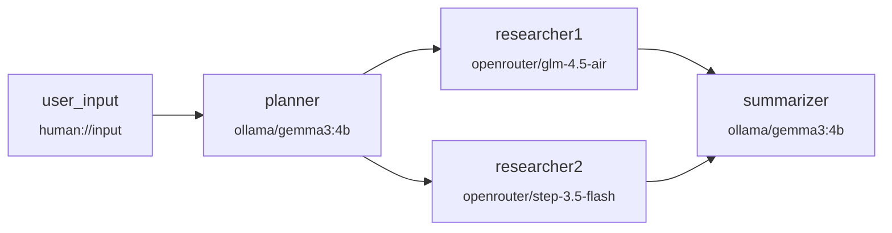
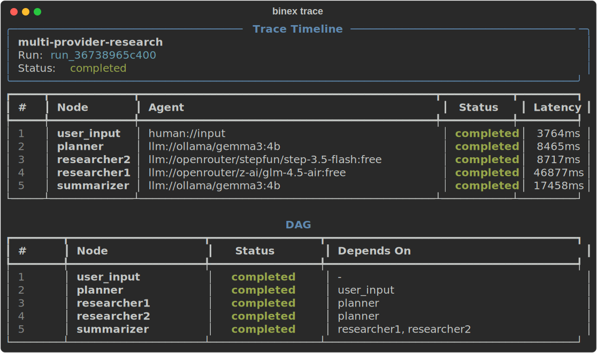
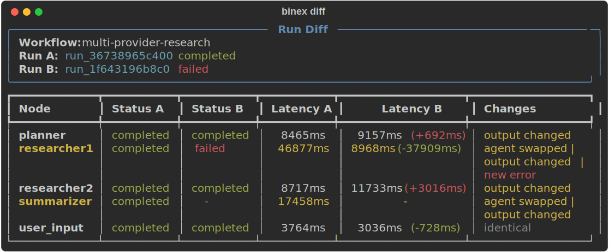
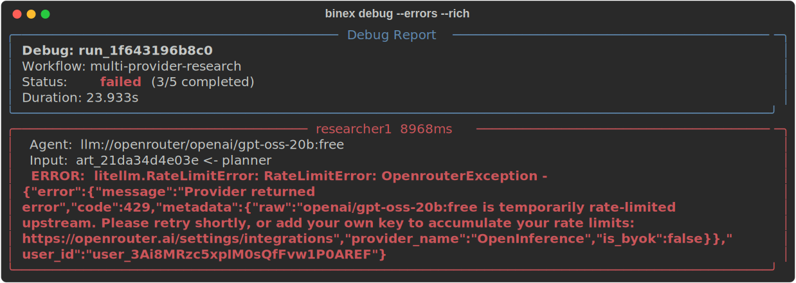
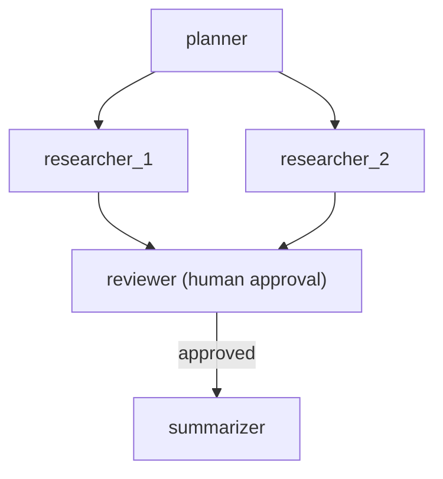
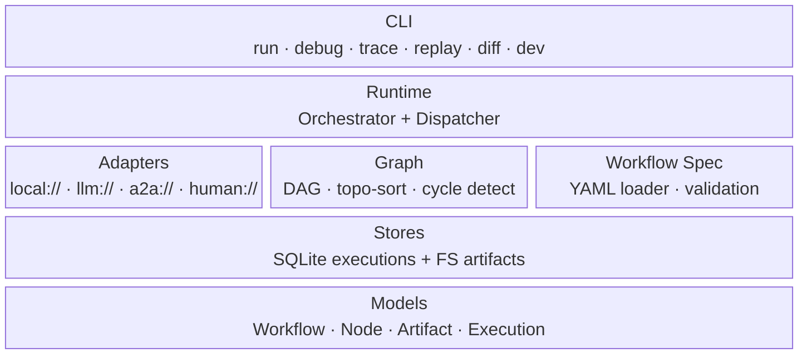

<a id="readme-top"></a>

<div align="center">
  <h1>
    <br>
    
    <br>
    Binex
    <br>
  </h1>

  <p align="center">
    <strong>Debuggable runtime for AI agent pipelines</strong>
    <br>
    Orchestrate multi-agent workflows. Trace every step. Replay and diff runs.
  </p>

  <p>
    <a href="https://github.com/Alexli18/binex/actions"></a>
    <a href="https://github.com/Alexli18/binex/blob/master/LICENSE"></a>
    
    
    
    
    <a href="https://alexli18.github.io/binex/"></a>
  </p>

  <p>
    <a href="#-quickstart">Quickstart</a> &middot;
    <a href="https://alexli18.github.io/binex/">Documentation</a> &middot;
    <a href="https://github.com/Alexli18/binex/issues">Report Bug</a> &middot;
    <a href="https://github.com/Alexli18/binex/issues">Request Feature</a>
  </p>
</div>

<br>

---

## Why Binex?

Building multi-agent systems is hard. Debugging them is harder. **Binex** gives you:

- **YAML-first workflows** &mdash; define agent pipelines as readable DAGs, not tangled code
- **Full execution tracing** &mdash; every node call, every artifact, every millisecond recorded
- **Post-mortem debugging** &mdash; inspect any run after the fact with rich, filterable reports
- **Replay with agent swap** &mdash; re-run a workflow substituting different LLMs or agents
- **Run diffing** &mdash; compare two executions side-by-side to spot regressions
- **Human-in-the-loop** &mdash; approval gates and free-text input with conditional branching

<p align="right">(<a href="#readme-top">back to top</a>)</p>

---

## Demo

A multi-provider research pipeline: **Ollama** runs locally for planning and summarization, **OpenRouter** calls cloud models for parallel research &mdash; all in one YAML file.

<details>
<summary><strong>Requirements to run this demo</strong></summary>

- [Ollama](https://ollama.com/) installed and running locally
- Model pulled: `ollama pull gemma3:4b`
- Free [OpenRouter](https://openrouter.ai/) API key (set `OPENROUTER_API_KEY` in `.env`)
- Binex installed: `pip install -e .`

</details>

```yaml
# examples/multi-provider-demo.yaml
name: multi-provider-research

nodes:
  user_input:
    agent: "human://input"                          # ask the user for a topic

  planner:
    agent: "llm://ollama/gemma3:4b"                 # local LLM plans the research
    system_prompt: "Create a structured research plan with 3 subtopics..."
    inputs: { topic: "${user_input.result}" }
    depends_on: [user_input]

  researcher1:
    agent: "llm://openrouter/z-ai/glm-4.5-air:free"    # cloud model researches subtopic 1
    inputs: { plan: "${planner.result}" }
    depends_on: [planner]

  researcher2:
    agent: "llm://openrouter/stepfun/step-3.5-flash:free"  # cloud model researches subtopic 2
    inputs: { plan: "${planner.result}" }
    depends_on: [planner]

  summarizer:
    agent: "llm://ollama/gemma3:4b"                 # local LLM combines findings
    inputs: { research1: "${researcher1.result}", research2: "${researcher2.result}" }
    depends_on: [researcher1, researcher2]
```



Run it, explore results, debug the execution:

<div align="center">
  
</div>

<p align="right">(<a href="#readme-top">back to top</a>)</p>

---

## Quickstart

```bash
# Clone
git clone https://github.com/Alexli18/binex.git
cd binex

# Create and activate virtual environment
python -m venv .venv
source .venv/bin/activate   # Linux/macOS
# .venv\Scripts\activate    # Windows

# Install
pip install -e .

# Run the zero-config demo
binex hello

# Run a workflow
binex run examples/simple.yaml --var input="hello world"

# Debug a completed run
binex debug <run-id>
binex debug latest          # shortcut for the most recent run

# Optional: rich colored output
pip install -e ".[rich]"
binex debug latest --rich
```

<details>
<summary><strong>See it in action</strong></summary>

```
$ binex hello

Running built-in hello-world workflow...

  [1/2] greeter ...
  [greeter] -> result:
Hello from Binex!

  [2/2] responder ...
  [responder] -> result:
{"greeter": "Hello from Binex!"}

Run completed (2/2 nodes)
Run ID: run_d71c9a50

Next steps:
  binex debug run_d71c9a50    — inspect the run
  binex init                  — create your own project
  binex run examples/simple.yaml — try a workflow file
```

```
$ binex run examples/simple.yaml --var input="hello world"

Run ID: run_69651bec
Workflow: simple-pipeline
Status: completed
Nodes: 2/2 completed
╭──────────────────────── consumer ────────────────────────╮
│ { "art_producer": { "msg": "hello world" } }             │
╰──────────────────────── result ──────────────────────────╯
```

</details>

<p align="right">(<a href="#readme-top">back to top</a>)</p>

---

## Trace & Debug

Every run is fully recorded. Inspect the execution timeline and DAG:

```bash
binex trace <run-id>
```

<div align="center">
  
</div>

Compare two runs side-by-side — spot status changes, latency deltas, and output differences:

```bash
binex diff <run-a> <run-b>
```

<div align="center">
  
</div>

Post-mortem debug of a failed run — see errors, prompts, and artifacts per node:

```bash
binex debug <run-id> --errors --rich
```

<div align="center">
  
</div>

<p align="right">(<a href="#readme-top">back to top</a>)</p>

---

## How It Works

Define a workflow in YAML. Binex builds a DAG, schedules nodes respecting dependencies, dispatches each to the right agent adapter, and records everything.

```yaml
name: research-pipeline
description: "Fan-out research with human approval"

nodes:
  planner:
    agent: "llm://openai/gpt-4"
    system_prompt: "Break this topic into 3 research questions"
    inputs:
      topic: "${user.topic}"
    outputs: [questions]

  researcher_1:
    agent: "llm://anthropic/claude-sonnet-4-20250514"
    inputs: { question: "${planner.questions}" }
    outputs: [findings]
    depends_on: [planner]

  researcher_2:
    agent: "a2a://localhost:8001"
    inputs: { question: "${planner.questions}" }
    outputs: [findings]
    depends_on: [planner]

  reviewer:
    agent: "human://approve"
    inputs:
      draft: "${researcher_1.findings}"
    outputs: [decision]
    depends_on: [researcher_1, researcher_2]

  summarizer:
    agent: "llm://openai/gpt-4"
    inputs:
      research: "${researcher_1.findings}"
    outputs: [summary]
    depends_on: [reviewer]
    when: "${reviewer.decision} == approved"
```



<p align="right">(<a href="#readme-top">back to top</a>)</p>

---

## Architecture



<p align="right">(<a href="#readme-top">back to top</a>)</p>

---

## Features

### Agent Adapters

| Prefix | Adapter | Description |
|--------|---------|-------------|
| `local://` | LocalPythonAdapter | In-process Python callable |
| `llm://` | LLMAdapter | LLM completion via LiteLLM (40+ providers) |
| `a2a://` | A2AAgentAdapter | Remote agent via A2A protocol |
| `human://input` | HumanInputAdapter | Terminal prompt for free-text input |
| `human://approve` | HumanApprovalAdapter | Approval gate with conditional branching |

### CLI Commands

| Command | Description |
|---------|-------------|
| `binex run <workflow.yaml>` | Execute a workflow |
| `binex debug <run-id\|latest>` | Post-mortem inspection (`--json`, `--errors`, `--node`, `--rich`) |
| `binex trace <run-id>` | Execution timeline, node details, or DAG graph |
| `binex replay <run-id>` | Re-run with optional agent swaps |
| `binex diff <run1> <run2>` | Compare two runs side-by-side |
| `binex artifacts list <run-id>` | List artifacts with lineage tracking |
| `binex validate <workflow.yaml>` | Validate YAML before execution |
| `binex scaffold workflow "A -> B"` | Generate workflow from DSL shorthand |
| `binex start` | Interactive wizard to create a workflow step-by-step |
| `binex init` | Interactive project setup (workflow / agent / full) |
| `binex dev up` | Start Docker dev stack (Ollama + LiteLLM + Registry) |
| `binex doctor` | Check system health |
| `binex explore` | Interactive browser for runs and artifacts |
| `binex hello` | Zero-config demo |

### DSL Shorthand

Generate workflows from simple expressions:

```bash
binex scaffold workflow "planner -> researcher, analyst -> summarizer"
```

Nine built-in patterns available: `simple`, `diamond`, `fan-out`, `fan-in`, `map-reduce`, and more.

### LLM Providers

Out-of-the-box support for 9 providers via LiteLLM:

**OpenAI** &middot; **Anthropic** &middot; **Google Gemini** &middot; **Ollama** &middot; **OpenRouter** &middot; **Groq** &middot; **Mistral** &middot; **DeepSeek** &middot; **Together AI**

<p align="right">(<a href="#readme-top">back to top</a>)</p>

---

## Project Structure

```
src/binex/
├── adapters/        # Agent execution backends (local, LLM, A2A, human)
├── agents/          # Built-in agent implementations
├── cli/             # Click CLI commands
├── graph/           # DAG construction + topological scheduling
├── models/          # Pydantic v2 domain models
├── registry/        # FastAPI agent registry service
├── runtime/         # Orchestrator, dispatcher, lifecycle
├── stores/          # SQLite execution + filesystem artifact persistence
├── trace/           # Debug reports, lineage, timeline, diffing
├── workflow_spec/   # YAML loader + validator + variable resolution
└── tools.py         # Tool calling support (@tool decorator)
```

<p align="right">(<a href="#readme-top">back to top</a>)</p>

---

## Built With

<p>
  
  
  
  
  
  
  
  
</p>

<p align="right">(<a href="#readme-top">back to top</a>)</p>

---

## Examples

The [`examples/`](examples/) directory contains 22 ready-to-run workflows:

| Example | What it demonstrates |
|---------|---------------------|
| `hello-world.yaml` | Minimal two-node pipeline |
| `diamond.yaml` | Diamond dependency pattern |
| `fan-out-fan-in.yaml` | Parallel research with aggregation |
| `human-in-the-loop.yaml` | Approval gates and conditional branching |
| `multi-provider-research.yaml` | Multiple LLM providers in one workflow |
| `a2a-multi-agent.yaml` | Remote agents via A2A protocol |
| `conditional-routing.yaml` | Branch based on node output |
| `map-reduce.yaml` | MapReduce-style aggregation |

<p align="right">(<a href="#readme-top">back to top</a>)</p>

---

## Documentation

Full docs available at **[alexli18.github.io/binex](https://alexli18.github.io/binex/)**:

- [Quickstart](https://alexli18.github.io/binex/quickstart/) &mdash; install and run your first workflow
- [Concepts](https://alexli18.github.io/binex/concepts/agents/) &mdash; agents, workflows, artifacts, execution model
- [CLI Reference](https://alexli18.github.io/binex/cli/run/) &mdash; every command with options and examples
- [Architecture](https://alexli18.github.io/binex/architecture/overview/) &mdash; runtime internals and design decisions
- [Workflow Format](https://alexli18.github.io/binex/workflows/format/) &mdash; complete YAML schema reference

<p align="right">(<a href="#readme-top">back to top</a>)</p>

---

## Development

```bash
# Clone
git clone https://github.com/Alexli18/binex.git
cd binex

# Create virtual environment
python -m venv .venv
source .venv/bin/activate

# Install with dev dependencies
pip install -e ".[dev]"

# Run tests (870 tests, 96% coverage)
python -m pytest tests/

# Lint
ruff check src/

# Start dev environment (Ollama + LiteLLM + Registry)
binex dev up
```

<p align="right">(<a href="#readme-top">back to top</a>)</p>

---

## Roadmap

See [`ROADMAP.md`](ROADMAP.md) for the full roadmap, or a summary below:

- [ ] Web UI for execution visualization
- [ ] Plugin system for custom adapters
- [ ] Framework adapters (LangChain, CrewAI, AutoGen)
- [ ] Workflow versioning and migration
- [ ] Distributed execution across multiple runtimes
- [ ] OpenTelemetry integration for observability

See the [open issues](https://github.com/Alexli18/binex/issues) for a full list of proposed features and known issues.

<p align="right">(<a href="#readme-top">back to top</a>)</p>

---

## Contributing

Contributions are welcome! Here's how:

1. Fork the Project
2. Create your Feature Branch (`git checkout -b feature/amazing-feature`)
3. Commit your Changes (`git commit -m 'Add amazing feature'`)
4. Push to the Branch (`git push origin feature/amazing-feature`)
5. Open a Pull Request

<p align="right">(<a href="#readme-top">back to top</a>)</p>

---

## License

Distributed under the MIT License. See [`LICENSE`](LICENSE) for more information.

<p align="right">(<a href="#readme-top">back to top</a>)</p>

---

<div align="center">
  <sub>Built with focus on debuggability, because AI agents shouldn't be black boxes.</sub>
</div>
